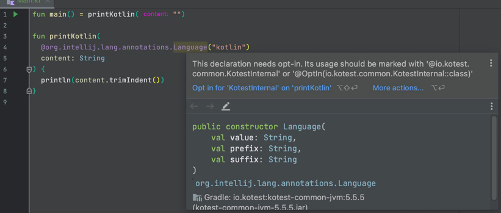

# Kotest `@Language` annotation shadowing reproducer

The new language injection annotation is prioritized over the IntelliJ one.



Build task output:

```text
w: [...]Main.kt:4:34 This declaration needs opt-in. Its usage should be marked with '@io.kotest.common.KotestInternal' or '@OptIn(io.kotest.common.KotestInternal::class)'
```
